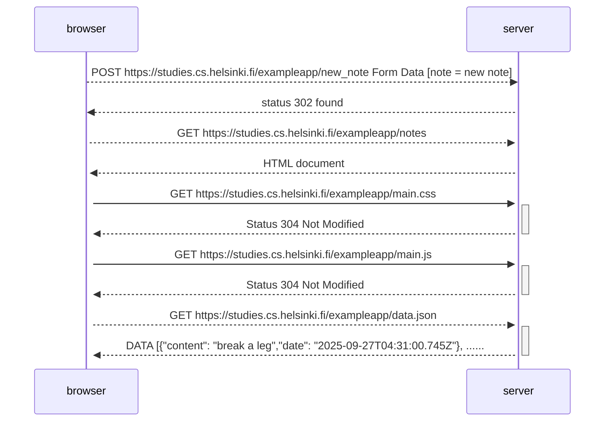

```mermaid
sequenceDiagram
    participant browser
    participant server

    browser -->> server: POST https://studies.cs.helsinki.fi/exampleapp/new_note  Form Data [note = new note] 
    activate server
    server -->> browser: status 302 found
    activate browser

    browser -->> server: GET https://studies.cs.helsinki.fi/exampleapp/notes
    activate server
    server -->> browser: HTML document
    activate browser

    browser->> server: GET https://studies.cs.helsinki.fi/exampleapp/main.css
    activate server
    server-->> browser: Status 304 Not Modified
    deactivate server

    browser->>server: GET https://studies.cs.helsinki.fi/exampleapp/main.js
    activate server
    server-->>browser: Status 304 Not Modified
    deactivate server

    browser -->> server: GET https://studies.cs.helsinki.fi/exampleapp/data.json
    activate server
    server -->> browser: DATA [{"content": "break a leg","date": "2025-09-27T04:31:00.745Z"}, ......
    deactivate server
```
