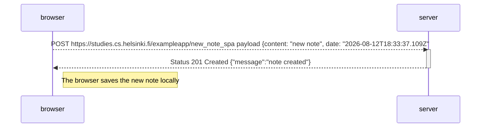

```mermaid
sequenceDiagram
    participant browser
    participant server

    browser -->> server: POST https://studies.cs.helsinki.fi/exampleapp/new_note_spa   payload  {content: "new note", date: "2026-08-12T18:33:37.109Z"
    activate server

    server -->> browser: Status 201 Created   {"message":"note created"}
    deactivate server    

    Note right of browser: The browser saves the new note locally 
```
